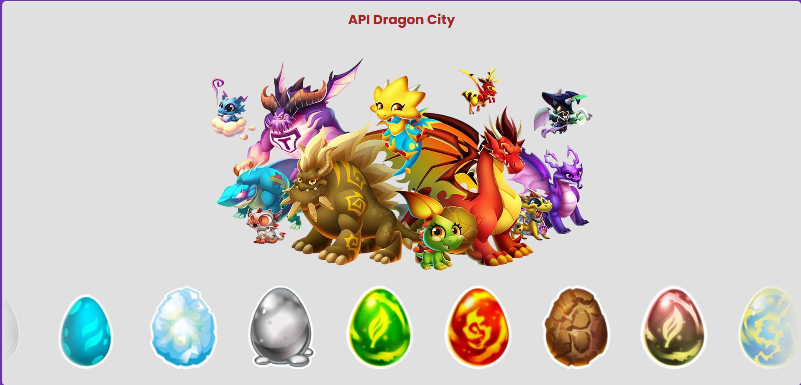

# API Dragon City 🐉

## Descrição
API do Dragão City, incluindo informações de fases (ovo, bebê, adulto) e raridade.

## Requisitos
- **Instalação de dependências**: Utilize `pip` para instalar os pacotes necessários.

## Configuração Local
1. Clone este repositório:
    ```bash
    git clone https://github.com/seu-usuario/seu-repositorio.git
    ```

2. Instale as dependências:
    ```bash
    pip install -r requirements.txt
    ```

3. Crie a env e ative ela:
    ```bash
    python -m venv env
    cd env/Scripts/activate  
    ```

4. Importando o Banco de Dados
1. Certifique-se de que o XAMPP está rodando e que o MySQL está ativo.
2. Acesse o phpMyAdmin no navegador ([http://localhost/phpmyadmin](http://localhost/phpmyadmin)).
3. Clique na aba **Importar**.
4. Escolha o arquivo `dragon_city.sql` localizado na pasta `database/` do projeto.
5. Clique em **Executar**.
6. Pronto! O banco de dados estará configurado com os registros existentes.


5. Inicie o servidor:
    ```bash
    uvicorn main:app --reload
    ```
    ou então:
    python .\main.py

5. Acesse no navegador:
    - API: [http://127.0.0.1:8000](http://127.0.0.1:8000)
    - Pagina Principal [http://127.0.0.1:8000/api/v1/dragon](http://127.0.0.1:8000/api/v1/dragon)
    - Documentação automática: [http://127.0.0.1:8000/docs](http://127.0.0.1:8000/docs)


## Exemplo do Projeto
Aqui está um exemplo do projeto rodando:




## Observações
- Caso tenha dúvidas, entre em contato 😊: 
[](https://www.linkedin.com/in/gabriela-alejandra-278b39355)      
[](mailto:gabrielasantos70707@gmail.com)


